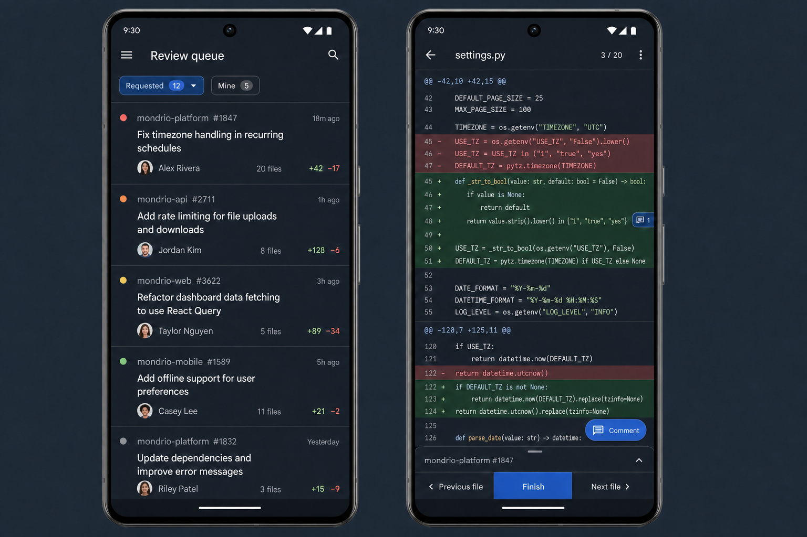

# Ramo Mobile Redesign

**Date:** 2026-07-28
**Status:** Approved design, awaiting implementation plan

## Objective

Make Ramo a focused Android pull-request reader that is comfortable to use on a phone. The app must open real pull requests reliably, keep code as the dominant content, and make reviewing a sequence of files feel faster than GitHub Mobile.

The redesign replaces the current mobile presentation rather than layering new colors on it. It uses the approved seamless dark direction (“B”), with changed-file counts added to every inbox row.

## Problems being corrected

1. The current screens render unspecified text with Compose's default black content color over a dark activity background. `MaterialTheme` is present, but the screen content is not hosted by a Material surface or scaffold that provides the expected content color.
2. Opening a pull request crashes on syntax-highlighted rows. A 32-bit ARGB value is passed to Compose's packed 64-bit color constructor, causing an invalid color-space index and an `ArrayIndexOutOfBoundsException`.
3. The inbox header draws inside the status-bar and display-cutout area. Account controls are crowded against system UI.
4. The inbox is visually heavy and card-like, while the review screen spends too much space on chrome relative to code.

## Product scope

This design covers authentication handoff, the pull-request inbox, file-by-file diff review, inline draft comments, viewed progress, review submission, notification prompting, loading, and failure states.

It does not add providers beyond GitHub, split diffs, swipe-based file navigation, a light theme, rich PR editing, merge controls, or new review capabilities. Existing secure token storage, Rust networking, notification synchronization, comment persistence, and GitHub publication remain the underlying behavior.

## Visual system

Ramo uses one high-contrast dark Material 3 scheme for this release:

- A dark slate window background and a subtly lighter reading surface; never pure black stacked on pure black.
- Off-white primary text and clearly lighter-than-background secondary text.
- Blue for focus, selection, and the primary action.
- Accessible green and rose for additions and deletions, always accompanied by `+` and `−` markers so color is not the only signal.
- Thin dividers and spacing establish row boundaries. Pull requests are not placed in cards.
- Android sans-serif is used for interface text. Monospace is restricted to code and line numbers.
- Code starts at a comfortable phone size and continues honoring the existing persisted code-size preference and Android font scaling.
- Normal text targets WCAG AA contrast of at least 4.5:1; large text and meaningful icons target at least 3:1.
- Interactive targets are at least 48 dp even when their visible icon is smaller.

The Activity participates in edge-to-edge drawing, while each screen applies Material window insets. Top app bars consume status-bar and display-cutout insets. Bottom controls consume navigation-bar and gesture insets. The keyboard uses resize behavior so draft controls remain visible.

## Inbox

The inbox is a single seamless review queue:

- The safe-area top bar contains `Review queue`, search, and an overflow menu. There is no hamburger menu and no account text in the header.
- The overflow menu contains refresh, settings, account identity, and sign out.
- `Requested` and `Mine` filters retain their current review-request and authored-PR meanings, with item counts visible.
- Pull-to-refresh remains available.
- Each row shows status/attention, repository and PR number, update time, a two-line title, author, changed-file count, additions, and deletions.
- Rows use full-width tap targets, subtle pressed/selected feedback, and dividers. They do not use card containers, shadows, or extra decorative surfaces.
- Cached data remains readable while a refresh is underway or has failed. A small last-updated indication and dismissible error communicate staleness without replacing the queue.
- Opening a row moves directly to the first changed file; there is no intermediate PR-summary screen.

## Review screen

The review screen displays exactly one file at a time in a unified diff:

- The safe-area top bar contains Back, the current filename, `current / total` file progress, and overflow actions.
- Tapping the file progress opens a bottom sheet containing every changed file, its additions/deletions, and viewed state. Selecting a file closes the sheet and opens that file.
- The unified diff owns the remaining viewport. It preserves line numbers, syntax highlighting, hunk headers, inline existing conversations, context expansion, and horizontal scrolling for long lines.
- Diff foreground colors are decoded from sanitized 32-bit ARGB values. Invalid or absent syntax colors fall back to the normal code foreground and can never abort composition.
- Addition and deletion backgrounds are distinct but restrained enough for syntax text to remain legible.
- A comment marker indicates lines with conversations or local drafts without obscuring code.
- A collapsed PR strip above the bottom navigation shows repository/PR identity and expands for concise PR metadata when requested.
- The bottom navigation provides `Previous file`, `Finish`, and `Next file`. It is always above navigation/gesture insets.
- File navigation is explicit. Horizontal swipes remain reserved for code scrolling.

## Comment interaction

- Tapping a commentable line selects it without opening the keyboard.
- Tapping a second compatible line extends the selection to a contiguous range. A valid range stays on one GitHub side and within a compatible hunk.
- Selection is visually obvious in both line-number and code areas.
- The `Comment` action opens a bottom-sheet composer for the selected range.
- Saving closes the composer, keeps the draft inline, persists it securely, and clears the selection.
- Cancelling keeps the review unchanged. Publication or network failures never discard the draft.
- Existing remote conversations remain visually distinct from new local drafts.

## Viewed progress

- Reaching the end of a fully loaded file automatically marks it viewed.
- A snackbar immediately offers `Undo`.
- Viewed state is reflected in the file sheet and overall progress.
- A failed GitHub synchronization restores the previous local state and presents a dismissible retryable error.
- Explicit file navigation does not mark partially read files viewed.

## Finishing a review

`Finish` opens the existing finish-review flow as a bottom sheet. It lists pending drafts, accepts an optional overall comment, and offers Comment, Approve, or Request changes under the existing GitHub rules. A final confirmation shows the exact number of new comments and verdict before publication.

Publishing remains atomic. A stale revision, authorization failure, or network failure keeps all drafts and returns the user to the review with an actionable message.

## Notifications and settings

The notification prompt is removed from the inbox. After the first successful sign-in, a one-time bottom sheet offers `Enable notifications` and `Not now`. Dismissing it is persistent; notification permission remains available in Settings.

Settings owns code size, notification controls, account identity, and sign out. It is reached from the inbox overflow menu and respects the same surface, contrast, touch-target, and inset rules.

## State and data flow

The app remains a single-Activity Compose application backed by its existing ViewModels and Rust bridge:

1. Authentication restoration selects authentication or inbox content.
2. Inbox state exposes cached items immediately and refreshes through the repository.
3. Selecting a PR creates review state keyed by repository and PR number.
4. Review metadata loads before the first file; file pages and context continue loading lazily.
5. UI models sanitize provider/native data before composables receive it, including all color values and line targets.
6. Draft and viewed mutations update local state optimistically, synchronize through the repository, and explicitly roll back when synchronization fails.

Screen composables receive immutable UI state and event callbacks. Navigation, loading, selection, draft, and publication state remain in ViewModels rather than being hidden in individual rows.

## Failure behavior

- Loading failures render inside the destination with Back and Retry; they never close the Activity.
- Invalid syntax metadata degrades to neutral code styling.
- Network and synchronization failures use dismissible banners or snackbars while preserving usable cached content.
- Unexpected provider messages are converted into bounded, user-facing failures without exposing tokens or raw native exceptions.
- Drafts survive process recreation and all failed publication paths.
- Repeated retry actions are idempotent and do not duplicate rows, drafts, or reviews.

## Verification

Implementation is complete only when all of the following pass:

1. A regression test supplies the malformed syntax color that currently crashes PR opening and proves it renders with a safe fallback.
2. Compose UI tests verify content colors, safe-area coordinates, minimum touch targets, seamless inbox rows with file counts, filter selection, file-sheet navigation, line-range selection, draft persistence, viewed/undo behavior, and finish-review navigation.
3. ViewModel tests verify cached loading, rollback after viewed-state failure, retained drafts, retry behavior, and publication failure paths.
4. Screenshot or pixel assertions cover representative inbox and review states at a normal phone width and a narrow phone width using the approved dark palette.
5. Rust and Android unit/instrumentation suites pass without warnings or crashes.
6. A debug/release APK is installed on the connected Samsung device. An actual Mondrio pull request opens, code remains readable, files can be navigated, a range comment can be drafted, viewed state can be undone, and Back returns to the cached inbox.

## Acceptance criteria

- No normal body or code text is black on a dark surface.
- No critical text or controls overlap the status bar, camera cutout, navigation bar, gesture area, or keyboard.
- Every inbox row includes the changed-file count.
- Tapping any loadable PR cannot terminate the process.
- The diff remains unified and one-file-at-a-time.
- The inbox uses seamless rows rather than cards.
- The code viewport is the dominant area of the review screen.
- Comments, viewed progress, file navigation, and review publication remain functional and recover safely from failure.
